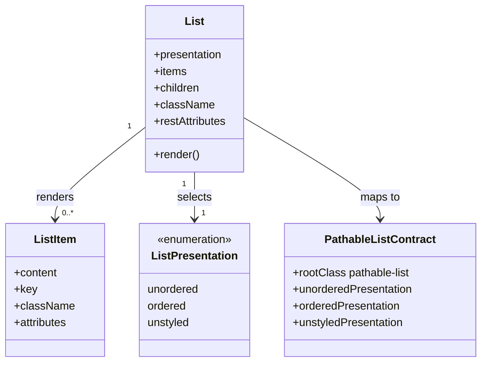

# Class Diagram: React List Wrapper

## Responsibility Notes

- `List` is the only new React component planned for this feature.
- `ListItem` is a contract concept for item-driven rendering and validation; it
  does not require a separately exported component.
- `PathableListContract` remains owned by `packages/styles`.
