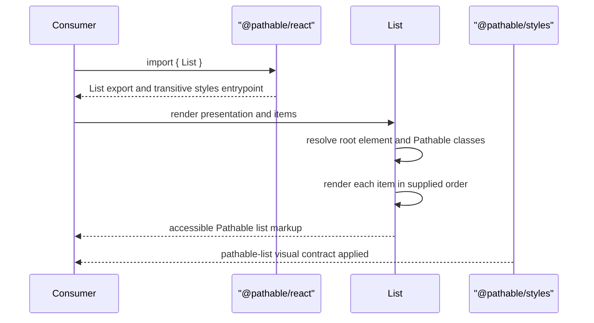
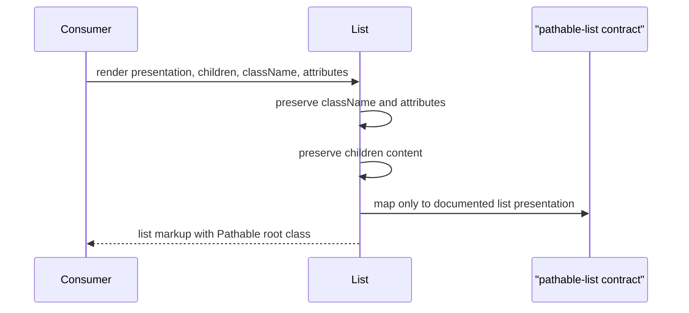
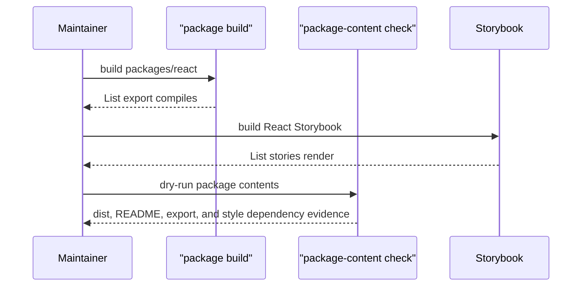

# Sequence Contracts: React List Wrapper

## Render Item-Driven List

```mermaid
sequenceDiagram
    participant Consumer
    participant ReactPackage as "@pathable/react"
    participant List
    participant Styles as "@pathable/styles"

    Consumer->>ReactPackage: import { List }
    ReactPackage-->>Consumer: List export and transitive styles entrypoint
    Consumer->>List: render presentation and items
    List->>List: resolve root element and Pathable classes
    List->>List: render each item in supplied order
    List-->>Consumer: accessible Pathable list markup
    Styles-->>Consumer: pathable-list visual contract applied
```

## Render Consumer-Composed Content

```mermaid
sequenceDiagram
    participant Consumer
    participant List
    participant Styles as "pathable-list contract"

    Consumer->>List: render presentation, children, className, attributes
    List->>List: preserve className and attributes
    List->>List: preserve children content
    List->>Styles: map only to documented list presentation
    List-->>Consumer: list markup with Pathable root class
```

## Package Validation

```mermaid
sequenceDiagram
    participant Maintainer
    participant Build as "package build"
    participant Pack as "package-content check"
    participant Storybook

    Maintainer->>Build: build packages/react
    Build-->>Maintainer: List export compiles
    Maintainer->>Storybook: build React Storybook
    Storybook-->>Maintainer: List stories render
    Maintainer->>Pack: dry-run package contents
    Pack-->>Maintainer: dist, README, export, and style dependency evidence
```
