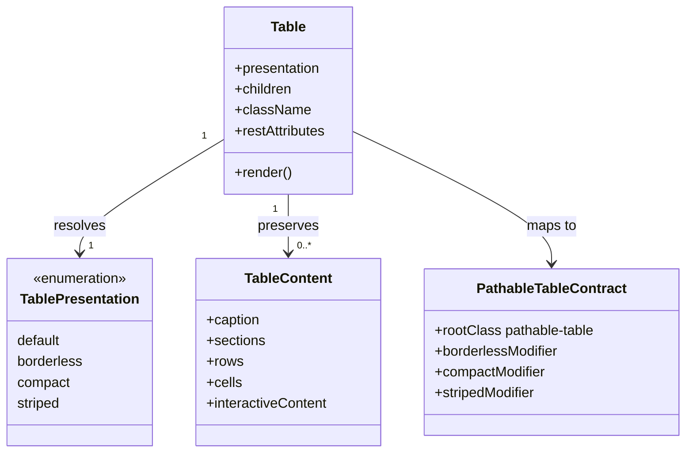

# Class Diagram: React Table Wrapper

## Responsibility Notes

- `Table` is the only new public React component in this feature.
- `TableContent` describes consumer-owned native markup, not a wrapper data API.
- `PathableTableContract` remains owned by `packages/styles`.
