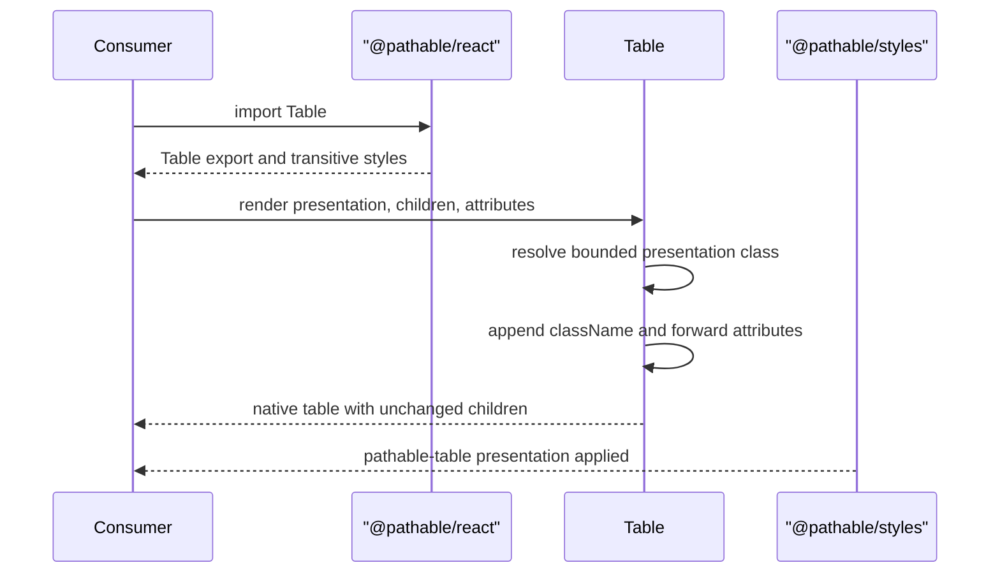
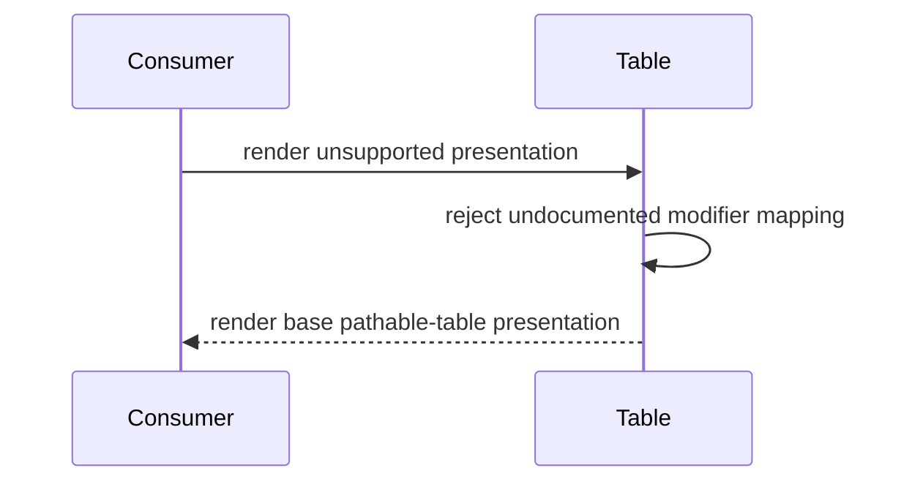
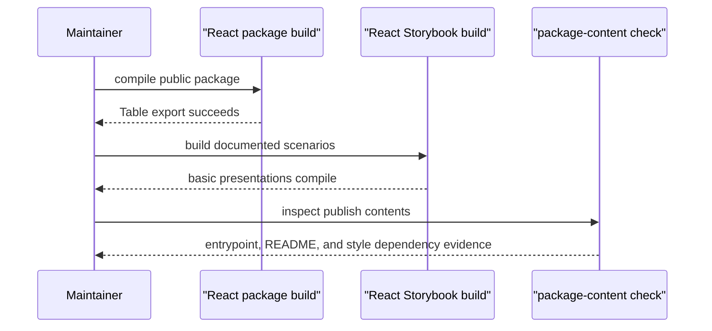

# Sequence Contracts: React Table Wrapper

## Render a Semantic Table

```mermaid
sequenceDiagram
    participant Consumer
    participant Package as "@pathable/react"
    participant Table
    participant Styles as "@pathable/styles"

    Consumer->>Package: import Table
    Package-->>Consumer: Table export and transitive styles
    Consumer->>Table: render presentation, children, attributes
    Table->>Table: resolve bounded presentation class
    Table->>Table: append className and forward attributes
    Table-->>Consumer: native table with unchanged children
    Styles-->>Consumer: pathable-table presentation applied
```

## Unsupported Presentation Fallback

```mermaid
sequenceDiagram
    participant Consumer
    participant Table

    Consumer->>Table: render unsupported presentation
    Table->>Table: reject undocumented modifier mapping
    Table-->>Consumer: render base pathable-table presentation
```

## Package Validation

```mermaid
sequenceDiagram
    participant Maintainer
    participant Build as "React package build"
    participant Storybook as "React Storybook build"
    participant Pack as "package-content check"

    Maintainer->>Build: compile public package
    Build-->>Maintainer: Table export succeeds
    Maintainer->>Storybook: build documented scenarios
    Storybook-->>Maintainer: basic presentations compile
    Maintainer->>Pack: inspect publish contents
    Pack-->>Maintainer: entrypoint, README, and style dependency evidence
```
