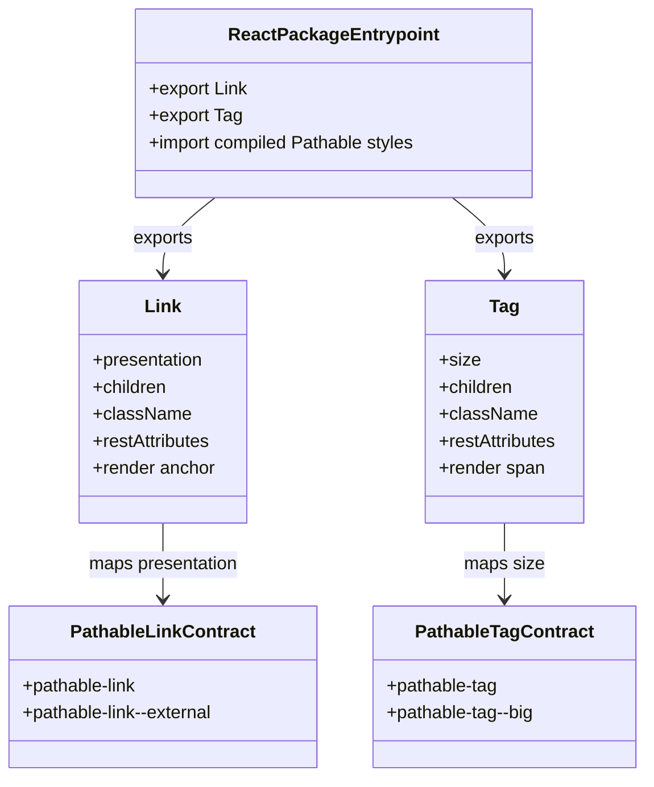

# Class Diagram: React Link and Tag Wrappers

## Responsibility Boundaries

- `Link` owns only semantic anchor rendering, bounded class selection, and prop forwarding.
- `Tag` owns only semantic span rendering, bounded class selection, and prop forwarding.
- The Pathable source contracts own all visual behavior.
- The package entrypoint owns public exports and transitive style delivery.
- Consumers own content, navigation policy, accessibility labeling, handlers,
  and composition-specific classes.
