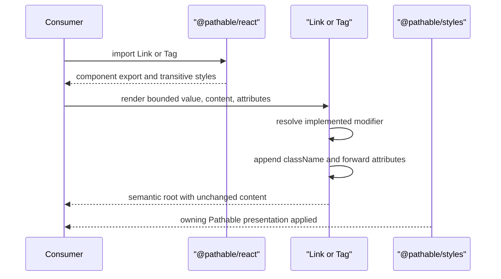
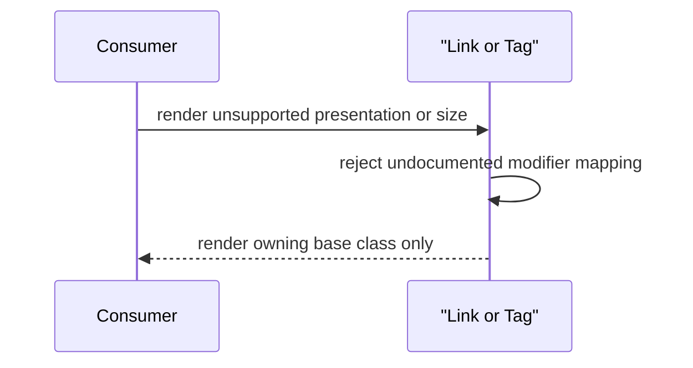
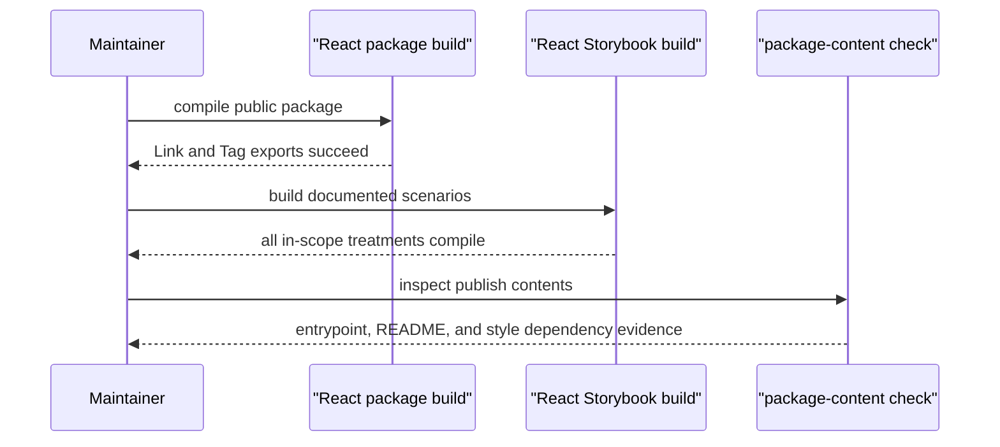

# Sequence Contracts: React Link and Tag Wrappers

## Render Link or Tag



## External Link Presentation

```mermaid
sequenceDiagram
    participant Consumer
    participant Link

    Consumer->>Link: render external presentation with navigation props
    Link->>Link: add pathable-link--external
    Link-->>Consumer: anchor with navigation props unchanged
```

## Unsupported Value Fallback



## Package Validation


