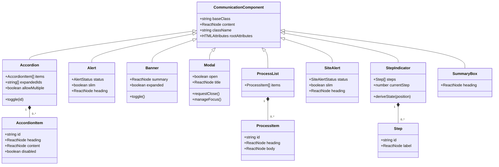

# Class Diagram: React Communication Wrappers

```mermaid
classDiagram
    class CommunicationComponent {
      +string baseClass
      +ReactNode content
      +string className
      +HTMLAttributes rootAttributes
    }

    class Accordion {
      +AccordionItem[] items
      +string[] expandedIds
      +boolean allowMultiple
      +toggle(id)
    }
    class AccordionItem {
      +string id
      +ReactNode heading
      +ReactNode content
      +boolean disabled
    }
    class Alert {
      +AlertStatus status
      +boolean slim
      +ReactNode heading
    }
    class Banner {
      +ReactNode summary
      +boolean expanded
      +toggle()
    }
    class Modal {
      +boolean open
      +ReactNode title
      +requestClose()
      +manageFocus()
    }
    class ProcessList {
      +ProcessItem[] items
    }
    class ProcessItem {
      +string id
      +ReactNode heading
      +ReactNode body
    }
    class SiteAlert {
      +SiteAlertStatus status
      +boolean slim
      +ReactNode heading
    }
    class StepIndicator {
      +Step[] steps
      +number currentStep
      +deriveState(position)
    }
    class Step {
      +string id
      +ReactNode label
    }
    class SummaryBox {
      +ReactNode heading
    }

    CommunicationComponent <|-- Accordion
    CommunicationComponent <|-- Alert
    CommunicationComponent <|-- Banner
    CommunicationComponent <|-- Modal
    CommunicationComponent <|-- ProcessList
    CommunicationComponent <|-- SiteAlert
    CommunicationComponent <|-- StepIndicator
    CommunicationComponent <|-- SummaryBox
    Accordion "1" *-- "0..*" AccordionItem
    ProcessList "1" *-- "0..*" ProcessItem
    StepIndicator "1" *-- "0..*" Step
```
