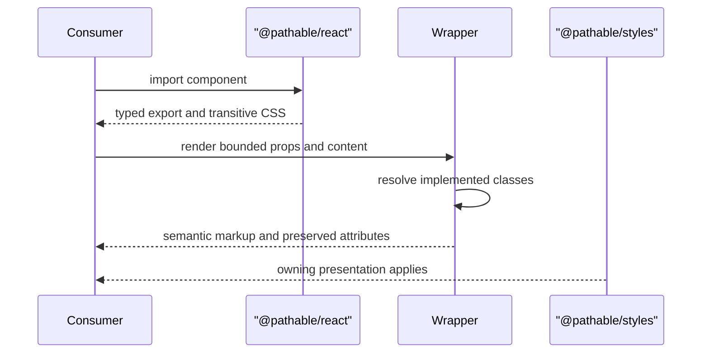
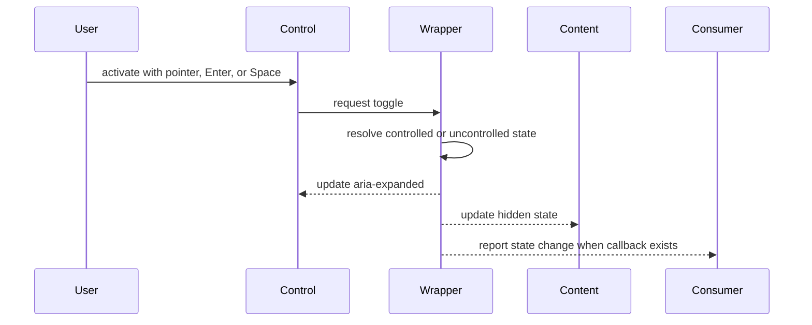
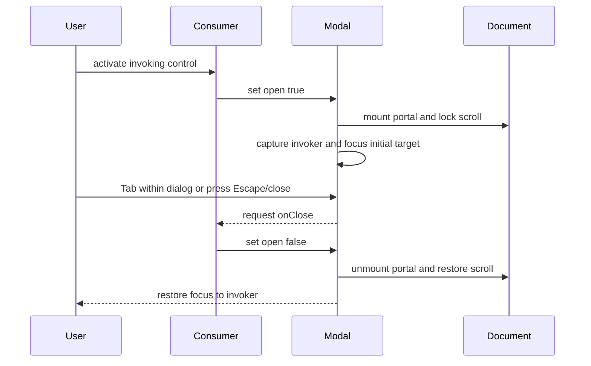
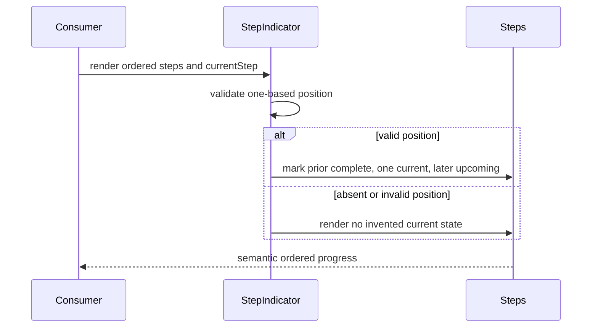
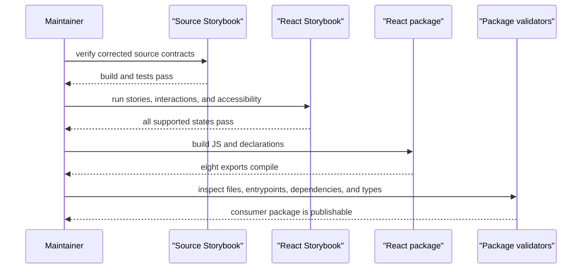

# Sequence Contracts: React Communication Wrappers

## Render a Presentational Component

## Toggle Accordion or Banner Disclosure

## Open and Close Modal

## Derive Step State

## Package Validation

