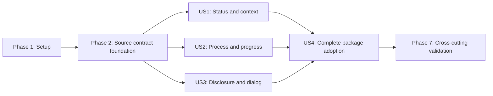

# Tasks: React Communication Wrappers

**Input**: Design documents from `specs/033-react-communication-wrappers/`  
**Prerequisites**: `plan.md`, `spec.md`, `research.md`, `data-model.md`,
`contracts/`, and passing readiness checklists

**Tests**: Required by the feature specification for semantic behavior,
keyboard/focus interaction, rendered accessibility, visual regression,
Storybook independence, and package distribution.

**Organization**: Tasks are grouped by user story so each increment remains
independently implementable and testable.

## Table of Contents

- [Format](#format-id-p-story-description)
- [Phase 1: Setup](#phase-1-setup-shared-infrastructure)
- [Phase 2: Foundational](#phase-2-foundational-blocking-prerequisites)
- [Phase 3: User Story 1](#phase-3-user-story-1---communicate-status-and-important-context-priority-p1-mvp)
- [Phase 4: User Story 2](#phase-4-user-story-2---explain-progress-and-ordered-work-priority-p2)
- [Phase 5: User Story 3](#phase-5-user-story-3---reveal-and-focus-communication-content-priority-p3)
- [Phase 6: User Story 4](#phase-6-user-story-4---adopt-the-complete-communication-set-priority-p4)
- [Phase 7: Polish](#phase-7-polish--cross-cutting-concerns)
- [Dependencies](#dependencies--execution-order)
- [Parallel Examples](#parallel-execution-examples)
- [Implementation Strategy](#implementation-strategy)

## Format: `[ID] [P?] [Story] Description`

- **[P]**: Can run in parallel because it targets different files and has no
  dependency on another incomplete task in the same batch.
- **[Story]**: Maps a task to User Story 1, 2, 3, or 4.
- Every task includes an exact file or directory path.

## Phase 1: Setup (Shared Infrastructure)

**Purpose**: Confirm the active feature boundary and prepare the Communication
component/story locations without altering package architecture.

- [ ] T001 Reconcile the verified selector and behavior inventory against `packages/styles/src/pathable-component-wrappers/` and record any blocking drift in `specs/033-react-communication-wrappers/research.md`
- [X] T002 [P] Create the planned component folders under `packages/react/src/components/{Accordion,Alert,Banner,Modal,ProcessList,SiteAlert,StepIndicator,SummaryBox}/`
- [X] T003 [P] Create the Communication story directory and deterministic shared fixture module at `packages/react/src/stories/components/Communication/fixtures.tsx`

**Checkpoint**: Feature scope and implementation paths match the approved plan.

---

## Phase 2: Foundational (Blocking Prerequisites)

**Purpose**: Correct source Storybook drift so React work can consume a truthful
and authoritative source contract.

**Critical**: No user-story implementation begins until this phase passes.

- [X] T004 [P] Remove the unsupported border-box state and document verified Accordion disclosure behavior in `packages/styles/src/stories/components/Communication/Accordion.stories.ts`
- [X] T005 [P] Remove unsupported Alert subelement class claims while preserving implemented status and slim examples in `packages/styles/src/stories/components/Communication/Alert.stories.ts`
- [X] T006 [P] Replace Banner dismissal claims and malformed markup with the verified header/button/content disclosure contract in `packages/styles/src/stories/components/Communication/Banner.stories.ts`
- [X] T007 [P] Align Modal markup and documentation to the implemented root/content/heading/footer/close contract and verified focus behavior in `packages/styles/src/stories/components/Communication/Modal.stories.ts`
- [X] T008 [P] Remove the unsupported process body class while preserving ordered semantic content in `packages/styles/src/stories/components/Communication/ProcessList.stories.ts`
- [X] T009 [P] Remove unsupported warning, dismissal, and subelement class claims from `packages/styles/src/stories/components/Communication/SiteAlert.stories.ts`
- [X] T010 [P] Expand semantic current/completed-state guidance without adding states in `packages/styles/src/stories/components/Communication/StepIndicator.stories.ts`
- [X] T011 [P] Expand purpose, misuse, and rich-content guidance without adding classes in `packages/styles/src/stories/components/Communication/SummaryBox.stories.ts`
- [X] T012 Build and test the corrected source catalog and resolve contract failures in `packages/styles/src/stories/components/Communication/`
- [X] T013 Verify shared synthetic fixtures cover status, long/localized content, ordered steps, disclosure panels, and dialog actions in `packages/react/src/stories/components/Communication/fixtures.tsx`

**Checkpoint**: Source Storybook is truthful, independently valid, and ready to
serve as the wrapper authority.

---

## Phase 3: User Story 1 - Communicate Status and Important Context (Priority: P1) MVP

**Goal**: Deliver Alert, SiteAlert, and SummaryBox with bounded status/content
contracts and resilient executable examples.

**Independent Test**: Render every supported treatment with headings, rich and
long content, links, role overrides, and narrow layouts; verify content,
semantics, consumer attributes, and exact source-class mapping.

### Tests and Stories for User Story 1

- [X] T014 [P] [US1] Add failing typed stories for Playground, info/success/warning/error/emergency/slim, long content, narrow layout, role overrides, and fallback behavior in `packages/react/src/stories/components/Communication/Alert.stories.tsx`
- [X] T015 [P] [US1] Add failing typed stories for Playground, default/info/emergency/slim, long content, narrow layout, role overrides, and no warning/dismissal in `packages/react/src/stories/components/Communication/SiteAlert.stories.tsx`
- [X] T016 [P] [US1] Add failing typed stories for Playground, default, link, rich content, long content, and narrow layout in `packages/react/src/stories/components/Communication/SummaryBox.stories.tsx`

### Implementation for User Story 1

- [X] T017 [P] [US1] Implement typed status, slim, heading/body, role override, attribute forwarding, class merging, and safe fallback behavior in `packages/react/src/components/Alert/Alert.tsx`
- [X] T018 [P] [US1] Implement typed default/info/emergency, slim, heading/body, role override, attribute forwarding, class merging, and safe fallback behavior in `packages/react/src/components/SiteAlert/SiteAlert.tsx`
- [X] T019 [P] [US1] Implement typed heading, rich body/link preservation, attribute forwarding, and class merging in `packages/react/src/components/SummaryBox/SummaryBox.tsx`
- [X] T020 [US1] Run the User Story 1 Storybook interaction and accessibility scenarios and resolve failures in `packages/react/src/stories/components/Communication/{Alert,SiteAlert,SummaryBox}.stories.tsx`

**Checkpoint**: Status and contextual communication wrappers work independently
without interactive-component dependencies.

---

## Phase 4: User Story 2 - Explain Progress and Ordered Work (Priority: P2)

**Goal**: Deliver ProcessList and StepIndicator with semantic ordering and a
single deterministic current-step model.

**Independent Test**: Render ordered process items and first/middle/final/no
current progress states with long labels; verify item order, exactly one current
state when valid, completed-state derivation, and invalid-position fallback.

### Tests and Stories for User Story 2

- [X] T021 [P] [US2] Add failing typed stories for Playground, default, empty, long content, and narrow ordered processes in `packages/react/src/stories/components/Communication/ProcessList.stories.tsx`
- [X] T022 [P] [US2] Add failing typed stories for Playground, first/middle/final/no-current, invalid current, long labels, and narrow progress in `packages/react/src/stories/components/Communication/StepIndicator.stories.tsx`

### Implementation for User Story 2

- [X] T023 [P] [US2] Implement typed ordered ProcessItem rendering, semantic list structure, empty behavior, attribute forwarding, and implemented class mapping in `packages/react/src/components/ProcessList/ProcessList.tsx`
- [X] T024 [P] [US2] Implement typed Step records, one-based current-step validation, derived completed/current/upcoming state, semantic ordering, and attribute forwarding in `packages/react/src/components/StepIndicator/StepIndicator.tsx`
- [X] T025 [US2] Run the User Story 2 semantic and accessibility scenarios and resolve failures in `packages/react/src/stories/components/Communication/{ProcessList,StepIndicator}.stories.tsx`

**Checkpoint**: Process and progress wrappers are independently usable with no
status or interactive-wrapper dependency.

---

## Phase 5: User Story 3 - Reveal and Focus Communication Content (Priority: P3)

**Goal**: Deliver accessible React-owned Accordion, Banner, and Modal behavior
without importing the shared browser-global JavaScript bundle.

**Independent Test**: Using pointer and keyboard input, verify disclosure state,
single/multiple Accordion behavior, disabled items, stable relationships, Modal
portal/open/close behavior, focus entry and containment, Escape, scroll restore,
and focus return.

### Tests and Stories for User Story 3

- [X] T026 [P] [US3] Add failing typed stories and accessible-query play tests for Playground, default, multiple, initially expanded, disabled, long, narrow, and relationship behavior in `packages/react/src/stories/components/Communication/Accordion.stories.tsx`
- [X] T027 [P] [US3] Add failing typed stories and accessible-query play tests for Playground, collapsed, expanded, controlled, long, and narrow disclosure behavior in `packages/react/src/stories/components/Communication/Banner.stories.tsx`
- [X] T028 [P] [US3] Add failing typed stories and accessible-query play tests for closed trigger, open, initial focus, Tab containment, Escape/close, long content/actions, and narrow layout in `packages/react/src/stories/components/Communication/Modal.stories.tsx`

### Implementation for User Story 3

- [X] T029 [P] [US3] Implement typed Accordion items, stable control/panel identifiers, controlled/uncontrolled expanded state, single/multiple rules, disabled behavior, and attribute forwarding in `packages/react/src/components/Accordion/Accordion.tsx`
- [X] T030 [P] [US3] Implement typed Banner summary/details, stable relationship identifiers, controlled/uncontrolled disclosure state, and attribute forwarding in `packages/react/src/components/Banner/Banner.tsx`
- [X] T031 [P] [US3] Implement controlled Modal portal rendering, naming/description relationships, close requests, Escape, Tab containment, scroll locking, initial focus, cleanup, and focus restoration in `packages/react/src/components/Modal/Modal.tsx`
- [X] T032 [US3] Run User Story 3 keyboard, focus, rendered accessibility, reduced-motion, and forced-colors scenarios and resolve failures in `packages/react/src/stories/components/Communication/{Accordion,Banner,Modal}.stories.tsx`

**Checkpoint**: All interactive wrappers satisfy their behavior contract without
global DOM initialization or another user story.

---

## Phase 6: User Story 4 - Adopt the Complete Communication Set (Priority: P4)

**Goal**: Expose all eight typed components through the package, document their
use, and prove transitive styles, declarations, examples, and distributable
contents work for consumers.

**Independent Test**: Import all eight components from the public entrypoint in
a consumer-style composition, render their documented states without a direct
styles or JavaScript-helper import, and inspect the distributable package for
exports, declarations, README, and runtime dependency metadata.

### Tests and Stories for User Story 4

- [X] T033 [P] [US4] Add a failing deterministic workflow composition using all eight public imports in `packages/react/src/stories/components/Communication/CommunicationPatterns.stories.tsx`
- [X] T034 [P] [US4] Add consumer adoption, purpose, misuse, accessibility, supported-state, and no-extra-import guidance for all eight components in `packages/react/README.md`

### Implementation for User Story 4

- [X] T035 [US4] Export all eight components and their public item/prop types while preserving the transitive compiled-CSS import and excluding `@pathable/styles/js` in `packages/react/src/index.ts`
- [X] T036 [US4] Audit typed meta, autodocs, controls, fixed-state coverage, accessible queries, deterministic data, and composition boundaries across `packages/react/src/stories/components/Communication/`
- [X] T037 [US4] Build JavaScript and declarations and resolve export/type failures in `packages/react/src/index.ts` and `packages/react/src/components/{Accordion,Alert,Banner,Modal,ProcessList,SiteAlert,StepIndicator,SummaryBox}/*.tsx`
- [X] T038 [US4] Run publint, type-package validation, and package-content dry run and resolve distribution failures in `packages/react/package.json`, `packages/react/src/index.ts`, and `packages/react/README.md`
- [X] T039 [US4] Validate the five-minute consumer path and reconcile command or expected-result drift in `specs/033-react-communication-wrappers/quickstart.md`

**Checkpoint**: The complete public Communication set is independently
installable, documented, typed, and consumable.

---

## Phase 7: Polish & Cross-Cutting Concerns

**Purpose**: Run the full repository-relevant gates and close cross-story
quality risks without broadening the component contract.

- [X] T040 Run TypeScript, JavaScript lint, Markdown lint, style lint, token lint, and formatting gates and fix applicable findings in `packages/react/src/components/`, `packages/react/src/stories/components/Communication/`, and `packages/styles/src/stories/components/Communication/`
- [X] T041 Run independent source and React Storybook builds/tests and fix regressions in `packages/styles/src/stories/components/Communication/` and `packages/react/src/stories/components/Communication/`
- [X] T042 Review stable visual fixtures for typography, spacing, status treatment, focus, overflow, wrapping, icon alignment, and narrow layouts in `packages/react/src/stories/components/Communication/`
- [X] T043 Re-run React package build, publint, type-package validation, and `npm --cache /tmp/pathable-npm-cache pack --dry-run`, resolving failures in `packages/react/package.json` and `packages/react/src/index.ts`
- [X] T044 Audit for wrapper-only CSS, absent modifier output, global JavaScript imports, sensitive/nondeterministic examples, and validation bypasses across `packages/react/` and `packages/styles/src/stories/components/Communication/`
- [X] T045 Reconcile completed behavior, scope, and validation evidence against `specs/033-react-communication-wrappers/checklists/requirements.md` and `specs/033-react-communication-wrappers/checklists/behavior-testability.md`

---

## Dependencies & Execution Order

### Phase Dependencies

- **Phase 1 Setup**: Starts immediately.
- **Phase 2 Foundational**: Depends on Phase 1 and blocks all user stories.
- **US1, US2, and US3**: Depend only on Phase 2 and may proceed in parallel.
- **US4**: Depends on US1, US2, and US3 because it exports, composes, and
  validates the complete component set.
- **Polish**: Depends on all desired user stories.

### User Story Dependency Graph



### Within Each User Story

- Write typed stories and behavioral assertions before implementation and
  confirm they fail for the missing contract.
- Implement components after their story contracts exist.
- Run the story checkpoint before declaring the increment complete.
- Keep component files independent until the public-export phase.

### Parallel Opportunities

- T002 and T003 can run in parallel after T001.
- T004-T011 target separate source story files and can run in parallel.
- US1, US2, and US3 can run concurrently after T012 and T013.
- Story/test files within a user story can be authored in parallel.
- Component implementations within a user story can be authored in parallel
  after their corresponding failing stories exist.
- T033 and T034 can run in parallel while US4 prepares the package surface.

## Parallel Execution Examples

### User Story 1

```text
Parallel stories: T014 Alert, T015 SiteAlert, T016 SummaryBox
Parallel implementation after stories fail: T017 Alert, T018 SiteAlert, T019 SummaryBox
Join: T020 User Story 1 validation
```

### User Story 2

```text
Parallel stories: T021 ProcessList, T022 StepIndicator
Parallel implementation after stories fail: T023 ProcessList, T024 StepIndicator
Join: T025 User Story 2 validation
```

### User Story 3

```text
Parallel stories: T026 Accordion, T027 Banner, T028 Modal
Parallel implementation after stories fail: T029 Accordion, T030 Banner, T031 Modal
Join: T032 User Story 3 interaction and accessibility validation
```

### User Story 4

```text
Parallel preparation: T033 complete composition, T034 README guidance
Sequential package integration: T035 exports -> T036 story audit -> T037 build -> T038 package checks -> T039 consumer validation
```

## Implementation Strategy

### MVP First: User Story 1

1. Complete Setup and Foundational source alignment.
2. Write the three failing US1 story families.
3. Implement Alert, SiteAlert, and SummaryBox in parallel.
4. Run T020 and stop for independent MVP review.

### Incremental Delivery

1. **MVP**: US1 provides status and context communication.
2. **Increment 2**: US2 adds ordered process and progress communication.
3. **Increment 3**: US3 adds accessible disclosure and dialog behavior.
4. **Increment 4**: US4 publishes the complete typed package surface.
5. Finish with the full cross-cutting gate set.

### Parallel Team Strategy

After the source foundation passes, separate owners may take US1, US2, and US3.
US4 begins only after their public contracts are stable, preventing export and
composition churn.

## Notes

- `[P]` means different files and no dependency on another incomplete task in
  the same batch.
- `[US1]` through `[US4]` provide requirement-to-task traceability.
- No task creates wrapper CSS, unsupported source modifiers, application state,
  persistence, routing, analytics, or a validation bypass.
- Mark each task complete in this file as implementation evidence is produced.
