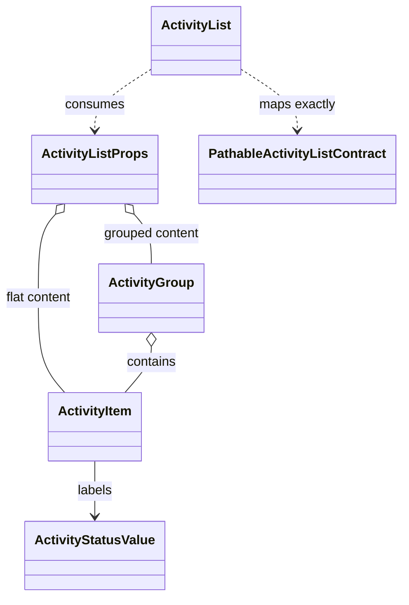

# Internal Object Design: React Activity List Wrapper

The feature has no service, repository, controller, or stateful object graph.
This diagram captures the type projection and source-contract dependency that
constrain implementation.

## Responsibilities

| Type | Responsibility |
| --- | --- |
| `ActivityList` | Select flat, grouped, or empty projection; preserve order; apply owned classes and semantics. |
| `ActivityListProps` | Make flat and grouped inputs mutually exclusive and expose only documented configuration. |
| `ActivityItem` | Carry stable row identity, complete content, status meaning, optional actions, and additive row attributes. |
| `ActivityGroup` | Carry stable group identity, visible heading, ordered items, and additive group attributes. |
| `ActivityStatusValue` | Admit documented values and unfamiliar consumer values without silent conversion. |
| `PathableActivityListContract` | Own status marker visuals, visible metadata treatment, density, responsiveness, actions, empty state, forced colors, and reduced motion. |
