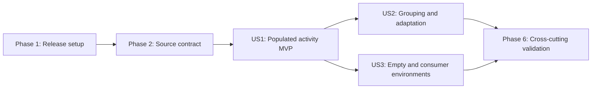

# Tasks: React Activity List Wrapper

**Input**: Design documents from `specs/037-react-activity-list/`  
**Prerequisites**: `plan.md`, `spec.md`, `research.md`, `data-model.md`,
`contracts/`, `quickstart.md`, and passing readiness checklists

**Tests**: Required by the feature specification for semantic behavior,
keyboard action access, rendered accessibility, responsive containment, visual
regression, server compatibility, and packed-package consumption.

**Organization**: Tasks are grouped by user story so each increment is
independently implementable and testable after the shared source correction.

## Table of Contents

- [Format](#format-id-p-story-description)
- [Phase 1: Setup](#phase-1-setup-shared-infrastructure)
- [Phase 2: Foundational](#phase-2-foundational-blocking-prerequisites)
- [Phase 3: User Story 1](#phase-3-user-story-1---present-dashboard-activity-priority-p1-mvp)
- [Phase 4: User Story 2](#phase-4-user-story-2---organize-and-adapt-the-list-priority-p2)
- [Phase 5: User Story 3](#phase-5-user-story-3---handle-empty-and-consumer-environments-priority-p3)
- [Phase 6: Polish](#phase-6-polish--cross-cutting-concerns)
- [Dependencies](#dependencies--execution-order)
- [Parallel Examples](#parallel-execution-examples)
- [Implementation Strategy](#implementation-strategy)

## Format: `[ID] [P?] [Story] Description`

- **[P]**: Can run in parallel because it targets different files and has no
  dependency on another incomplete task in the same batch.
- **[Story]**: Maps a task to User Story 1, 2, or 3.
- Every task includes an exact file or directory path.

## Phase 1: Setup (Shared Infrastructure)

**Purpose**: Record the two-package patch release intent before implementation
without changing versions or publishing.

- [ ] T001 Add one patch Changeset for `@pathableai/styles` and `@pathableai/react` describing the source-contract correction and new wrapper in `.changeset/bright-activities-align.md`

**Checkpoint**: Release intent is explicit and remains non-publishing.

---

## Phase 2: Foundational (Blocking Prerequisites)

**Purpose**: Correct and validate the authoritative Activity List source
contract before exposing any React behavior.

**Critical**: No user-story implementation begins until this phase passes.

- [ ] T002 Implement visible ellipsizing status text, shrinkable ellipsizing date text, and the shrinkable owner plus `__owner-text` contract while preserving marker, density, responsive, forced-colors, reduced-motion, action, and empty behavior in `packages/styles/src/pathable-component-wrappers/pathable-activity-list.scss`
- [ ] T003 Update the canonical helper and every fixed state to use a decorative status marker, visible status label, owner-text wrapper, adjacent named groups, and deterministic `LongContent` and `UnknownStatus` evidence in `packages/styles/src/stories/dashboard/ActivityList.stories.ts`
- [ ] T004 [P] Migrate both composed rows to decorative markers, visible status labels, and owner-text wrappers in `packages/styles/src/stories/dashboard/DashboardOverview.stories.ts`
- [ ] T005 [P] Migrate the activity builder and grouped markup to visible status labels, owner-text wrappers, and adjacent `aria-labelledby` groups in `packages/styles/src/stories/recipes/OperationalDashboard.stories.ts`
- [ ] T006 [P] Migrate the marketing-pattern activity builder to readable status labels and owner-text wrappers in `packages/styles/src/stories/marketing-patterns/OperationalDashboard.stories.ts`
- [ ] T007 Build, style-lint, and browser-test the corrected source contract and resolve failures attributable to `packages/styles/src/pathable-component-wrappers/pathable-activity-list.scss` and `packages/styles/src/stories/{dashboard,recipes,marketing-patterns}/`

**Checkpoint**: Styles owns a truthful, independently tested visual and markup
contract that React can consume without private CSS.

---

## Phase 3: User Story 1 - Present Dashboard Activity (Priority: P1) MVP

**Goal**: Deliver a public typed flat Activity List that preserves supplied row
order and content, visibly communicates known and unfamiliar statuses, and
keeps optional consumer actions accessible without fabricating absent actions.

**Independent Test**: Render three flat rows with mixed documented statuses,
one unfamiliar status, and both present and absent actions; verify list and
listitem roles, supplied order, all visible row fields, one accessible status
meaning, neutral unknown treatment, additive attributes, and keyboard action
focus and activation.

### Tests and Stories for User Story 1

> Write these executable stories and assertions first and confirm that the
> missing public component contract fails before implementation.

- [ ] T008 [US1] Add failing typed `Playground`, `MixedStatuses`, `UnknownStatus`, and `UngroupedWithoutActions` stories with accessible-query play assertions for `S-001`, `S-002`, and `S-003` in `packages/react/src/stories/dashboard/ActivityList.stories.tsx`

### Implementation for User Story 1

- [ ] T009 [US1] Implement the public item/status/density/attribute types and flat list projection with stable keys, supplied order, owned roles/classes, decorative literal `data-status` markers, visible labels, owner-text wrappers, additive attributes, and omitted absent actions in `packages/react/src/components/ActivityList/ActivityList.tsx`
- [ ] T010 [US1] Export `ActivityList`, `ActivityListProps`, `ActivityListDensity`, `ActivityStatus`, `ActivityStatusValue`, `ActivityItem`, `ActivityItemAttributes`, `ActivityGroup`, and `ActivityGroupAttributes` with `.js` specifiers while retaining the Styles side-effect import in `packages/react/src/index.ts`
- [ ] T011 [P] [US1] Document flat items, status values and labels, rich inline content, semantic time content, optional named actions, attribute forwarding, and consumer accessibility responsibilities in `packages/react/README.md`
- [ ] T012 [US1] Run React typecheck, lint, build, and Storybook browser/accessibility coverage and resolve User Story 1 failures in `packages/react/src/components/ActivityList/ActivityList.tsx` and `packages/react/src/stories/dashboard/ActivityList.stories.tsx`
- [ ] T013 [US1] Compare source and React known/unknown marker geometry, visible labels, supplied row order, absent-action omission, desktop focus reveal, and coarse/mobile action availability for `VIS-001` and `VIS-004` in `packages/styles/src/stories/dashboard/ActivityList.stories.ts` and `packages/react/src/stories/dashboard/ActivityList.stories.tsx`

**Checkpoint**: The populated flat Activity List is independently usable from
the React package and constitutes the MVP.

---

## Phase 4: User Story 2 - Organize and Adapt the List (Priority: P2)

**Goal**: Add grouped and ungrouped modes, empty-group omission, semantic
heading relationships, documented density mapping, and resilient long-content
behavior without changing supplied order or meaning.

**Independent Test**: Render two non-empty groups and one empty group at
default, compact, and comfortable density, then review long content at 375,
768, and 1280 pixels and increased text; verify adjacent resolving headings,
stable order, omitted empty groups, exact density classes, ellipsis, no page
overflow, date-first mobile order, and available unclipped actions.

### Tests and Stories for User Story 2

> Add the grouped, density, and responsive assertions before extending the
> component and confirm their missing behavior fails.

- [ ] T014 [US2] Add failing grouped `Default`, `Compact`, `Comfortable`, `Mobile`, and `LongContent` stories with accessible-query play assertions for `S-004`, `S-005`, and `S-006` in `packages/react/src/stories/dashboard/ActivityList.stories.tsx`

### Implementation for User Story 2

- [ ] T015 [US2] Implement mutually exclusive flat/grouped inputs, empty-group filtering, server-stable generated heading IDs, adjacent nested named lists, configurable heading levels, group attributes, documented density mapping, and safe runtime density fallback in `packages/react/src/components/ActivityList/ActivityList.tsx`
- [ ] T016 [P] [US2] Document grouped inputs, heading association, omitted empty groups, default/compact/comfortable density, and source-owned truncation and responsive limits in `packages/react/README.md`
- [ ] T017 [US2] Run the grouped semantic, density, responsive, increased-text, keyboard-focus, and accessibility story scenarios and resolve failures in `packages/react/src/components/ActivityList/ActivityList.tsx` and `packages/react/src/stories/dashboard/ActivityList.stories.tsx`
- [ ] T018 [US2] Compare source and React grouping, density, truncation, mobile ordering, horizontal containment, forced-colors markers, and focus containment for `VIS-001` through `VIS-004` at 375, 768, and 1280 pixels in `packages/styles/src/stories/dashboard/ActivityList.stories.ts` and `packages/react/src/stories/dashboard/ActivityList.stories.tsx`

**Checkpoint**: Grouping, density, and responsive behavior are independently
testable without empty/package-consumer behavior.

---

## Phase 5: User Story 3 - Handle Empty and Consumer Environments (Priority: P3)

**Goal**: Deliver consumer-authored empty output and prove that the server-first
public package exposes complete declarations, initial markup, and transitive
Activity List styling without a direct Styles import.

**Independent Test**: Render empty flat data and only-empty groups, then install
the packed packages in the representative Next App Router fixture; verify exact
empty structure, no fabricated rows or headings, no new server-compatibility
finding, public runtime/type exports, meaningful initial HTML, and Activity List
CSS without a separate consumer Styles import.

### Tests and Stories for User Story 3

> Add empty and packed-consumer failures before completing empty rendering and
> consumer integration.

- [ ] T019 [P] [US3] Add a failing deterministic `Empty` story and play assertions for zero flat rows, only-empty groups, exact empty structure, and omitted rows/headings from `S-008` in `packages/react/src/stories/dashboard/ActivityList.stories.tsx`
- [ ] T020 [P] [US3] Extend the packed Next fixture to import the runtime component and public types, render grouped known/unknown statuses and a link action, and assert initial HTML, declarations, and transitive Activity List CSS for `S-007` in `scripts/test-next-consumer.mjs`

### Implementation for User Story 3

- [ ] T021 [US3] Implement zero-resolved-row handling with only the required empty modifier and consumer-supplied empty region, no list role, and no fabricated message, row, status, group, or heading in `packages/react/src/components/ActivityList/ActivityList.tsx`
- [ ] T022 [P] [US3] Document empty content, server-default rendering, root-only React imports, automatic styling, and the absence of wrapper-owned fetching/loading/error behavior in `packages/react/README.md`
- [ ] T023 [US3] Run the advisory server-compatibility audit and resolve every new Activity List finding without adding a client tag or altering the six-finding baseline in `packages/react/src/components/ActivityList/ActivityList.tsx` and `packages/react/src/stories/dashboard/ActivityList.stories.tsx`
- [ ] T024 [US3] Run package-content, declaration, and packed Next consumer checks and resolve Activity List export, initial-output, or transitive-style failures in `packages/react/src/index.ts`, `packages/react/src/components/ActivityList/ActivityList.tsx`, and `scripts/test-next-consumer.mjs`

**Checkpoint**: Empty and packed server/browser consumer paths work from the
public React package with no separate design-system setup.

---

## Phase 6: Polish & Cross-Cutting Concerns

**Purpose**: Reconcile the complete catalog and run every applicable release
gate without broadening scope or publishing.

- [ ] T025 [P] Audit deterministic state names, typed meta and controls, accessible-query assertions, synthetic data, responsive parameters, and source/React parity across `packages/styles/src/stories/{dashboard,recipes,marketing-patterns}/` and `packages/react/src/stories/dashboard/ActivityList.stories.tsx`
- [ ] T026 Run JavaScript/TypeScript lint, style lint, Markdown lint, formatting, and whitespace checks and fix applicable findings in `packages/styles/src/pathable-component-wrappers/pathable-activity-list.scss`, `packages/styles/src/stories/`, `packages/react/`, `scripts/test-next-consumer.mjs`, `.changeset/bright-activities-align.md`, and `specs/037-react-activity-list/`
- [ ] T027 Run independent Styles and React builds plus both Storybook builds, browser tests, and rendered accessibility checks and resolve regressions in `packages/styles/src/stories/` and `packages/react/src/stories/dashboard/ActivityList.stories.tsx`
- [ ] T028 Run repository quality and visual gates, review `VIS-001` through `VIS-005` at 375, 768, and 1280 pixels with increased text and keyboard input, and resolve unexplained regressions in `packages/styles/src/pathable-component-wrappers/pathable-activity-list.scss` and both Activity List story catalogs
- [ ] T029 Re-run the advisory server audit, React package-content/type checks, and packed Next consumer validation and resolve failures in `packages/react/src/index.ts`, `packages/react/src/components/ActivityList/ActivityList.tsx`, and `scripts/test-next-consumer.mjs`
- [ ] T030 Run shared behavior-contract regression and Changesets status, confirm no Activity List consumer-action scenarios were added to the shared harness, and resolve release-metadata drift in `.changeset/bright-activities-align.md` and `specs/037-react-activity-list/contracts/`
- [ ] T031 Reconcile completed behavior, validation evidence, formal taxonomy blockers, and scope against `specs/037-react-activity-list/quickstart.md`, `specs/037-react-activity-list/checklists/requirements.md`, and `specs/037-react-activity-list/checklists/behavior-testability.md`

---

## Dependencies & Execution Order

### Phase Dependencies

- **Phase 1 Setup**: Starts immediately.
- **Phase 2 Foundational**: Depends on Phase 1 and blocks every user story.
- **US1**: Depends only on the source foundation and delivers the MVP.
- **US2**: Depends on the source foundation and the shared component/type shell
  established by US1; its grouped behavior remains independently testable.
- **US3**: Depends on the source foundation and public component/export shell
  established by US1; it does not depend on US2 except where the packed grouped
  fixture intentionally exercises the complete package.
- **Polish**: Depends on all desired user stories.

### User Story Dependency Graph



### Within Each User Story

- Write the named Storybook and packed-consumer assertions first and confirm
  they fail for the missing contract.
- Implement source-backed classes and semantic markup only after the failing
  evidence exists.
- Complete the story-specific validation task before declaring its checkpoint
  complete.
- Keep consumer action behavior native and consumer-owned; validate
  availability and activation without adding wrapper state.

### Parallel Opportunities

- T004-T006 can run in parallel after T002 because they update separate source
  composition stories.
- T011 can run alongside T009 after T008 establishes the US1 executable
  contract; T010 follows the component implementation.
- T016 can run alongside T015 after T014 establishes the US2 executable
  contract.
- T019 and T020 are independent failing evidence for empty rendering and packed
  consumption and can run in parallel; T022 can run alongside T021.
- T025 can start once all story catalogs exist while the remaining final gates
  wait for its audit findings.

## Parallel Execution Examples

### User Story 1

```text
Contract first: T008 failing flat/status/action stories
Parallel implementation: T009 component projection, T011 consumer guidance
Join: T010 public exports -> T012 automated checks -> T013 source/React review
```

### User Story 2

```text
Contract first: T014 failing grouping/density/responsive stories
Parallel implementation: T015 component behavior, T016 consumer guidance
Join: T017 automated checks -> T018 responsive and visual review
```

### User Story 3

```text
Parallel failing evidence: T019 empty story, T020 packed Next consumer
Parallel implementation: T021 empty projection, T022 consumer guidance
Join: T023 server audit -> T024 packed-package checks
```

## Implementation Strategy

### MVP First: User Story 1

1. Complete the patch-release setup and source-contract foundation.
2. Write and observe the failing US1 Storybook contract.
3. Implement and export the typed flat Activity List.
4. Complete T012 and T013, then stop for independent MVP review.

### Incremental Delivery

1. **Foundation**: Repair and validate the framework-neutral contract.
2. **MVP**: US1 delivers populated flat activity with statuses and actions.
3. **Increment 2**: US2 adds grouping, density, and responsive resilience.
4. **Increment 3**: US3 adds exact empty output and packed consumer proof.
5. **Closure**: Run all cross-cutting quality, visual, server, and package
   gates without publishing.

### Parallel Team Strategy

After the source foundation passes, one owner can complete US1 while another
prepares non-conflicting README guidance. Once the public shell is stable, US2
and US3 evidence can proceed in parallel in their separate story/script paths;
changes to the shared component file remain serialized.

## Notes

- `[P]` means different files and no dependency on another incomplete task in
  the same batch.
- `[US1]` through `[US3]` provide requirement-to-task traceability.
- Formal workflow-schema blockers for successful negative/validation cases do
  not create product errors or implementation tasks.
- No task creates wrapper-only CSS, new tokens or variants, business status
  inference, data fetching, sorting, filtering, pagination, persistence,
  client-only rendering, release publication, or a quality-rule bypass.
- Mark each task complete in this file as implementation evidence is produced.
