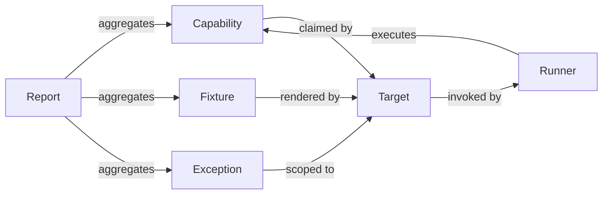
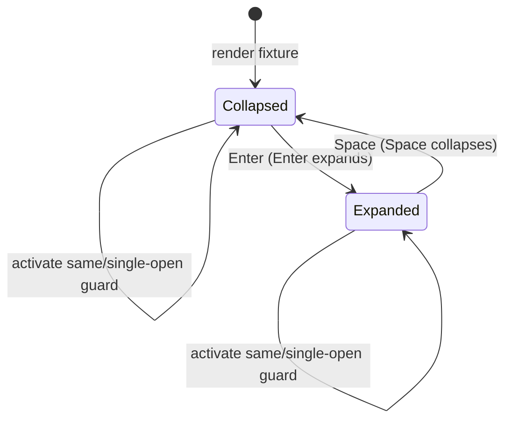

# Data Model: Component Test Infrastructure (Phase 1)

This artifact defines the domain entities and their relationships for the
Phase 1 component-testing infrastructure. It is renderer-neutral and
implementation-framing only; concrete paths and behavior belong to the runner
contract (`contracts/runner.md`) and the validation guide (`quickstart.md`).

## Entities

### Capability

A required, observable Accordion behavior that a target explicitly claims and
must execute.

| Attribute   | Type     | Notes                                               |
| ----------- | -------- | --------------------------------------------------- |
| `id`        | string   | Stable identity, e.g. `accordion.keyboard-enter`.   |
| `label`     | string   | Human-readable behavioral name.                    |
| `scope`     | enum     | `shared` (must first be proven by Styles).         |
| `state`     | enum     | `initial` or `resolved`.                            |

**Initial shared capabilities** (the Accordion capability manifest):

- `accordion.keyboard-enter` — Enter expands a collapsed disclosure.
- `accordion.keyboard-space` — Space collapses an expanded disclosure.
- `accordion.single-open` — activating a second item closes the first.
- `accordion.panel-association` — disclosure is associated with its panel.
- `accordion.panel-availability` — panel is available only when expanded.
- `accordion.focus-retention` — focus stays on the disclosure after activation.

**Explicitly package-specific** (not shared): controlled/uncontrolled props,
callbacks, refs, and server-rendering behavior.

**Unresolved shared scope** until the Styles package documents/exposes the same
promise: disabled-item behavior and multiple-open behavior.

### Contract Fixture

A deterministic initial Accordion state that a target makes available for a
capability.

| Attribute    | Type   | Notes                                               |
| ------------ | ------ | --------------------------------------------------- |
| `name`       | string | Shared fixture identity, e.g. `accordion.default`.  |
| `story`      | string | Target story identifier (e.g. `--default`).        |
| `expanded?`  | bool   | Whether the first disclosure starts expanded.       |

The Styles catalog provides at least a collapsed (`Default`) and an initially
expanded (`InitiallyExpanded`) fixture, matching the shared `accordion.default`
and `accordion.first-expanded` fixture names.

### Target

A registered framework package that renders deterministic fixtures and invokes
shared helpers within its own Storybook.

| Attribute           | Type   | Notes                                        |
| ------------------- | ------ | -------------------------------------------- |
| `name`              | string | e.g. `styles` (registered first).            |
| `workspace`         | string | Storybook workspace, e.g. `@pathable/storybook`. |
| `buildCommands`     | array  | Prerequisite builds, in order.               |
| `staticDirectory`   | string | Built output, e.g. `apps/storybook/storybook-static`. |
| `port`              | int    | Dedicated static-server port.                |
| `capabilities`      | array  | Capabilities this target claims.             |
| `fixtures`          | map    | Shared fixture name → target story id.       |

Validation rules: no shared required capability may be missing; no shared
fixture may be missing; `staticDirectory`, `port`, and `workspace` must be
present. Missing data is a hard (preflight) failure.

### Target-Aware Runner

The single orchestrator that, per registered target, builds, serves, checks
readiness, executes tests, labels results, and cleans up.

| Attribute   | Type   | Notes                                        |
| ----------- | ------ | -------------------------------------------- |
| `target`    | Target | The target being exercised.                  |
| `url`       | string | Direct `/iframe.html` story URL.            |
| `lifecycle` | enum   | `build → serve → ready → test → report → cleanup`. |

Failure semantics: unknown target, occupied port, missing build output, missing
story, or test failure is a hard failure; every owned browser and server is
stopped on success, failure, or signal (`SIGINT`/`SIGTERM`).

### Accessibility Exception

A narrow, reviewable exception scoped to a specific target, story, and Axe
rule.

| Attribute    | Type   | Notes                                        |
| ------------ | ------ | -------------------------------------------- |
| `target`     | string | Registered target.                           |
| `story`      | string | Narrowest story scope.                       |
| `rule`       | string | Specific Axe rule (no catalog-wide disable). |
| `rationale`  | string | Justification.                               |
| `tracking`   | string | Issue/PR reference.                          |

### Evidence Report

Per-feature output that measures three separate signals.

| Measure                | What it proves                          |
| ---------------------- | --------------------------------------- |
| Deterministic fixtures | Story presence and starting states.     |
| Contract adoption      | Executable capabilities proven.         |
| Automated Axe          | Rendered accessibility execution.       |

Visual smoke and manual keyboard/focus/assistive-technology review are separate
evidence and are never labeled WCAG certification.

## Relationships

## State Transitions

The Accordion disclosure state machine exercised by the shared capabilities:

Focus is retained on the disclosure control across both transitions. Panel
availability follows the expanded state (`hidden` when collapsed). Single-open
behavior closes any other item when a new one is activated.