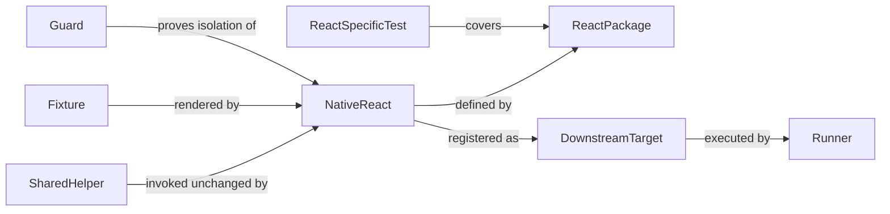
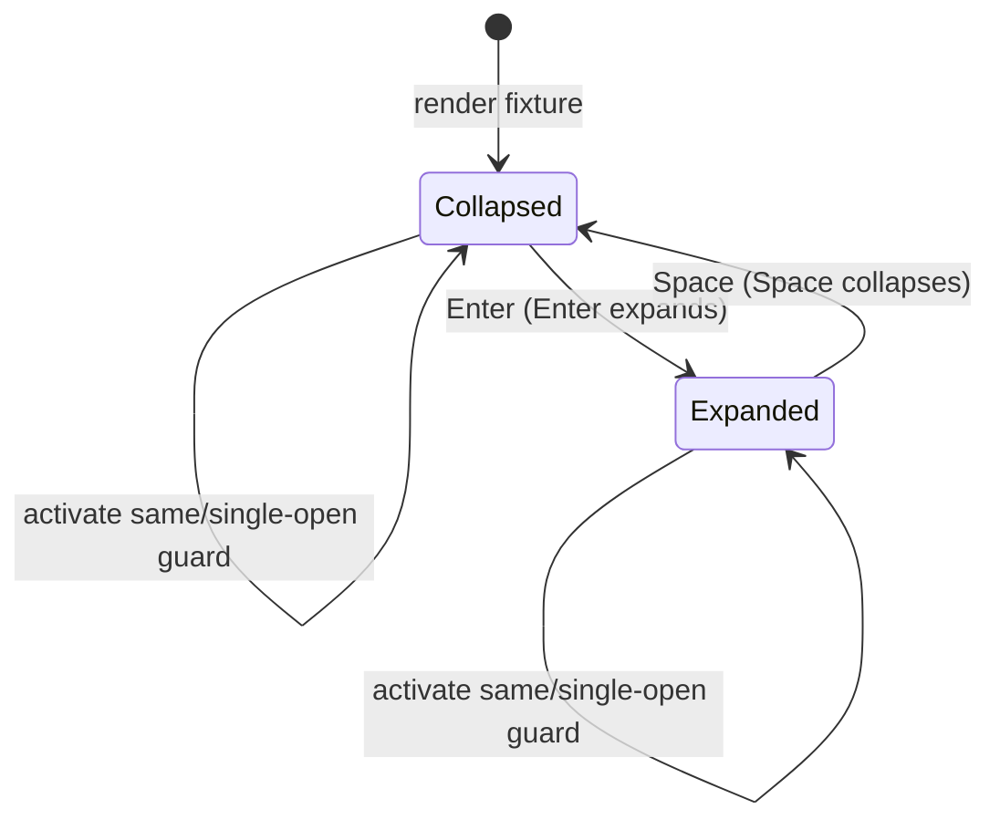

# Data Model: React Accordion Contract Adoption (Phase 2)

This artifact defines the domain entities and their relationships for adopting
the Styles-proven Accordion contract in the React Storybook. It is
renderer-neutral and implementation-framing only; concrete paths belong to the
adoption contract (`contracts/adoption.md`) and the validation guide
(`quickstart.md`).

## Entities

### Shared Accordion Helper

A renderer-neutral validator owned and proven by Styles in Phase 1 that React
stories invoke unchanged.

| Attribute  | Type   | Notes                                                            |
| ---------- | ------ | ---------------------------------------------------------------- |
| `id`       | string | Capability id, e.g. `accordion.keyboard-enter`.                  |
| `function` | string | One-capability function, e.g. `verifyEnterExpandsDisclosure`.   |
| `input`    | enum   | `HTMLElement` or a small structural interface.                  |
| `scope`    | enum   | `shared` (proven by Styles first).                              |

Initial shared helpers adopted unchanged: Enter expansion, Space collapse,
single-open, disclosure-to-panel association, panel availability, and focus
retention.

### Native React Implementation

The isolated Accordion behavior owned by the React package, verified without the
Styles DOM enhancement runtime.

| Attribute | Type   | Notes                                                       |
| --------- | ------ | ----------------------------------------------------------- |
| `package` | string | `@pathableai/react` Accordion implementation.              |
| `runtime` | enum   | `native` when the enhancement runtime is not loading.       |

### Isolation Guard

A check that the React Storybook does not load the Styles DOM enhancement
runtime for Accordion, and fails if both the native React handler and the
enhancement handler could own the same interaction.

| Attribute   | Type   | Notes                                                      |
| ----------- | ------ | ---------------------------------------------------------- |
| `runtime`   | enum   | `loaded` / `isolated` for Accordion.                      |
| `ownership` | enum   | `native-only` passes; `ambiguous` fails.                   |

### React Accordion Fixture

A deterministic React story matching a shared initial state used by the
unchanged helpers.

| Attribute | Type   | Notes                                                |
| --------- | ------ | -------------------------------------------------- |
| `name`    | string | Shared fixture identity, e.g. `accordion.default`.  |
| `story`   | string | React story id, e.g. `--default`.                  |
| `state`   | enum   | `collapsed` or `initially-expanded`.               |

The React catalog provides a collapsed (`Default`) and an initially expanded
(`InitiallyExpanded`) fixture matching the shared `accordion.default` and
`accordion.first-expanded` names, plus any additional deterministic fixed
stories needed for the shared capabilities.

### React-Specific Test

A test covering package-only behavior outside the shared contract.

| Attribute      | Type   | Notes                                                    |
| -------------- | ------ | -------------------------------------------------------- |
| `behavior`     | enum   | `controlled`, `uncontrolled`, `onExpandedChange`, `disabled`, `refs`, `server-rendering`. |
| `target`       | string | React package only.                                      |
| `shareable`    | bool   | Always `false`; intentionally excluded from the shared contract. |

### Downstream Target Registration

The addition of React to aggregate reporting after its isolated native
implementation passes.

| Attribute   | Type   | Notes                                        |
| ----------- | ------ | -------------------------------------------- |
| `name`      | string | `react`, registered after `styles`.          |
| `url`       | string | Direct `/iframe.html` story URL.            |
| `lifecycle` | enum   | `build → serve → ready → test → report → cleanup`. |

## Relationships

## State Transitions

The React Accordion disclosure state machine (`expandedIds` / `defaultExpandedIds`):

Isolation state: `Ambiguous` (native + enhancement share ownership) fails the
guard; `Native-only` passes registration. Focus is retained on the disclosure
across both transitions; panel availability follows expanded state. Single-open
closes any other item when a new one is activated.