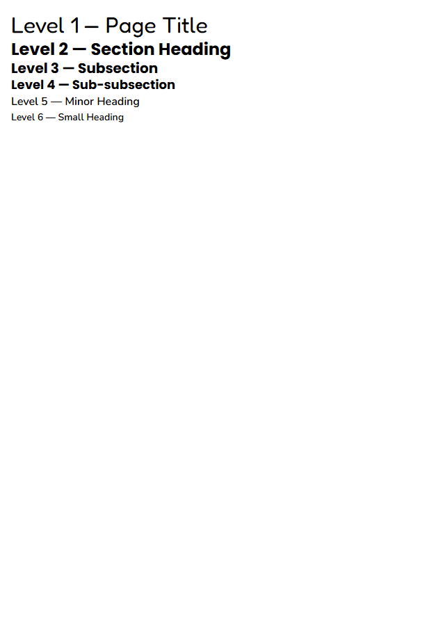
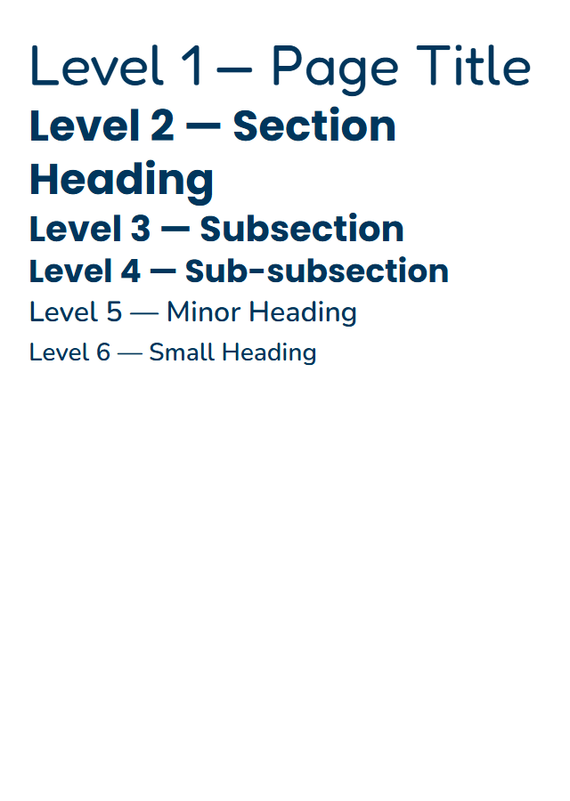

# Quickstart Validation Guide: Heading Primitive

## Prerequisites

- Node.js (matching the repo's `engines.node` range)
- pnpm (matching the repo's `packageManager` field)
- All dependencies installed: `pnpm install`

## Build

```bash
# Build all packages (styles first, then react)
pnpm build

# Or build individually:
pnpm --filter @pathableai/styles build
pnpm --filter @pathableai/react build
```

## Unit Tests

```bash
# Run Heading component tests
pnpm --filter @pathableai/react test:unit -- Heading

# Run all typography/layout primitive tests
pnpm --filter @pathableai/react test:unit -- Heading Text Grid Inline Cluster Stack Container
```

### Expected test coverage

- Each `level` (1–6) renders the correct HTML element (`h1`–`h6`)
- Each `level` (1–6) applies the correct modifier class (`.pathable-heading--level-{N}`)
- `visualLevel` overrides the modifier class while preserving the HTML element
- `visualLevel` omitted → modifier class matches `level`
- Ref forwarding: `ref.current` is the rendered heading DOM element
- Class composition: base class + level class + consumer `className` in correct order
- No wrapper DOM elements: `container.children.length === 1` and child is the heading element
- Server/client output identical: render with `renderToStaticMarkup` vs `render` matches

## TypeScript Check

```bash
pnpm --filter @pathableai/react check:types

# Compile errors expected for:
# - <Heading /> (missing required `level`)
# - <Heading level={0} /> (out of range)
# - <Heading level={7} /> (out of range)
# - <Heading level="2" /> (string not number)
# - <Heading level={1} as="div" /> (no `as` prop)
# - <Heading level={1} href="/" /> (invalid native prop for heading)
```

## Storybook

```bash
# Start the React Storybook
pnpm --filter @pathable/storybook-react storybook

# Run the registered React Storybook target
pnpm test:storybook-react

# Run every React Storybook story
pnpm test:storybook-react:all
```

### Expected stories

| Story | Props | What It Validates |
|-------|-------|-------------------|
| `Level1` | `level={1}` | h1 with display-lg styling (Fredoka, 32px) |
| `Level2` | `level={2}` | h2 with heading-lg styling (Poppins, 24px) |
| `Level3` | `level={3}` | h3 with heading-md styling (Poppins, 20px) |
| `Level4` | `level={4}` | h4 with heading-sm styling (Poppins, 18px) |
| `Level5` | `level={5}` | h5 with body-md bold styling (Nunito, 16px) |
| `Level6` | `level={6}` | h6 with body-sm bold styling (Nunito, 14px) |
| `VisualLevelDivergence` | `level={3} visualLevel={2}` | h3 element with h2 visual style class |
| `AllLevels` | Showcase of all 6 levels | Visual hierarchy check |
| `WithCustomClass` | `level={2} className="custom"` | Class composition |

## Accessibility Validation

### Contrast check

1. Open Storybook to any heading level story
2. Inspect the heading element's computed `color` against the surface `background-color`
3. Use browser DevTools or axe DevTools to verify contrast ratio ≥ 4.5:1
4. All levels must pass against the default `--pathable-color-surface` (#ffffff)

### Semantic structure check

1. Open the `AllLevels` story
2. Run axe DevTools or Accessibility Insights
3. Verify each heading has correct `role="heading"` and the appropriate heading level (implicit from the `h1`–`h6` element — no explicit `aria-level` attribute is needed or expected)
4. Verify no ARIA role override is applied (heading elements are natively correct)

### Forced-colors mode

1. Enable forced-colors: `forced-colors: active` in DevTools Rendering tab (Chrome) or use Windows High Contrast Mode
2. Verify all heading levels remain visually distinguishable by size/weight, not just color
3. Verify headings do not disappear or become invisible

### Zoom and reflow

1. Zoom browser to 200%
2. Verify heading text scales and wraps without clipping or overflow
3. Verify heading hierarchy remains visually clear

## Manual Inspection Checklist

- [x] `<Heading level={1}>` → `<h1 class="pathable-heading pathable-heading--level-1">`
- [x] `<Heading level={2}>` → `<h2 class="pathable-heading pathable-heading--level-2">`
- [x] `<Heading level={3}>` → `<h3 class="pathable-heading pathable-heading--level-3">`
- [x] `<Heading level={4}>` → `<h4 class="pathable-heading pathable-heading--level-4">`
- [x] `<Heading level={5}>` → `<h5 class="pathable-heading pathable-heading--level-5">`
- [x] `<Heading level={6}>` → `<h6 class="pathable-heading pathable-heading--level-6">`
- [x] `<Heading level={3} visualLevel={2}>` → `<h3 class="pathable-heading pathable-heading--level-2">`
- [x] `<Heading level={2} className="my-class">` → class list is `pathable-heading pathable-heading--level-2 my-class`
- [x] No extra wrapper elements (single DOM node)
- [x] Server and client output identical (no hydration mismatch)
- [x] TypeScript errors for missing `level` prop
- [x] TypeScript errors for out-of-range `level` values
- [x] TypeScript errors for invalid `as` prop

### Final audit evidence

- All nine Heading stories passed the registered Storybook Axe target with no
  exceptions; the full React Storybook run passed 59 suites and 654 stories.
- Browser inspection confirmed native `h1`–`h6` elements with no explicit
  `role` or `aria-level` overrides.
- Chromium forced-colors emulation preserved six distinct typography styles
  and visible text for all levels.
- At 200% zoom, every level remained readable, wrapped without clipping, and
  introduced no horizontal overflow.

#### Browser captures

Forced-colors mode:



200% zoom at a 640 px viewport:


